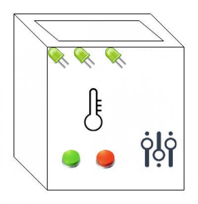
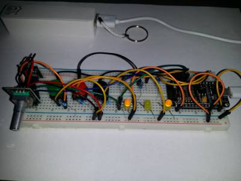

# Arduino reward box (WIP) 

Box. 20cm. With door on one side. On another: 3 leds, 2 buttons, 2 variable resistors, temperature sensor.

## Goal 

Open door through interacting with controls. There could be small reward in box. There are 3 tasks, each task have one or more inputs, and led. If player acted towards task (e.g. pressed correct button), corresponding led will blink. If player fulfill task, lets stays on. Next task could be completed, only if previous tasks are completed. 

## Prototype on breadboard 

Task 1: rotary encoder should be rotated 25 times any direction. When completed, 1st led remain on.

Task 2: green and black buttons need to be pressed down and red not pressed. If input changes, led goes off.

Task 3: light sensor should get significantly less light than it got during start.

How to win: rotate encoder until light stays on. Hold green and black buttons, so 2nd light is on. Cover light sensor with hand/finger, so 3rd light is on. Now all lights are on, and logic could open door (box and motor are missing from prototype).

## Prototype code 

https://github.com/petrukhnov/arduino-reward-box/blob/master/box1.ino

## Complexity levels 

Just example for above prototype:

  - press any button, rotate encoder, change light slightly
  - press specific button 3 times, rotate encoder one direction 360, change light slightly
  - remove light, hold red button, rotate encoder 10 times
  - ...
  - ...
  - press encoder, add more light than during start, hold black button, press and release green, then red
  - very hard to guess task
    - task1: hold red button, reduce light, press and release black button
    - task2: rotate encoder 720 clockwise, then press red  button before any other button
    - task3: hold encoder button, add more light, hold green button, remove as much light as possible, release green button

## UI 

### Sensors 

  * button
  * temperature
  * light
  * tilt (if box not mounted)
  * tilt on rotatably plate (if box mounted)
  * rotatory encoder
  * variable resistor
  * EM field (with magnet on a rope)
  * color sensor (with 3-7 colored tokens on a chain)
  * numpad
  * etc

Even more sensors: https://www.instructables.com/id/Arduino-37-in-1-Sensors-Kit-Explained/

### Output 

  * led
  * lcd digit
  * lcd screen
  * servo
  * something under transparent glass
  * etc

## Rewards 

  * sticker
  * candy
  * badge
  * etc
