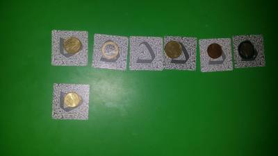

Teaching programming without coding/computers

There are many ways to teach people programming. With right abstraction, it is easy to explain most concepts. E.g. today we experimented with sorting things.

We took coins of different values and made kind of cells where they could be put in random order. Then added the same amount of cells below. With double empty space it was really easy to sort. Keeping only one free cell makes it more challenging:

The next goal was to try adding one coin at a time, but keep row sorted. It was nice to see how children discover various ways to simplify work: keeping extra space and expecting specific coin, applying bubble sort, etc.

Alternatively other toys could be used. E.g. Lego:

(originally published 2016-07-30)

